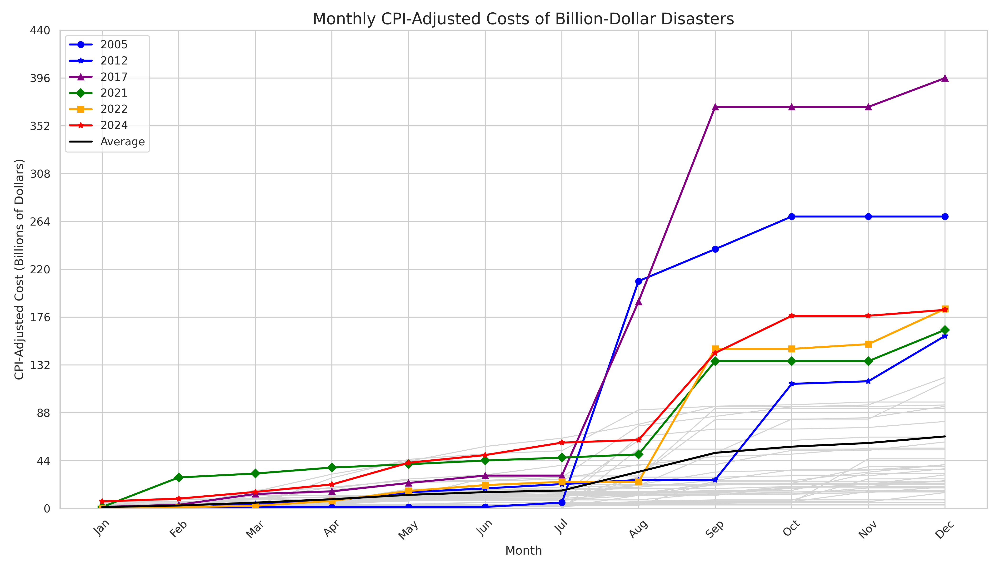
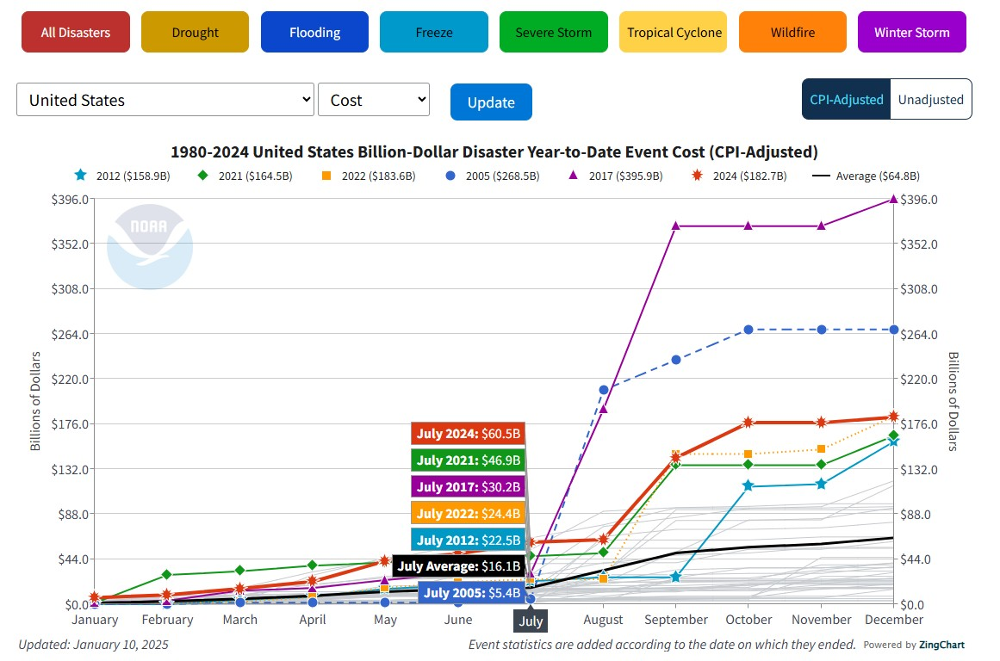

# open-climate-disaster-dashboard

Source: <https://www.ncei.noaa.gov/access/billions/>

- Notebook: [notebooks/01_data_exploration.ipynb](notebooks/01_data_exploration.ipynb)
- Script: [notebooks/01_data_exploration.py](notebooks/01_data_exploration.py)

## Data: NOAA NCEI U.S. Billion-Dollar Weather and Climate Disasters (2025)

NOAA National Centers for Environmental Information (NCEI) U.S. Billion-Dollar Weather and Climate Disasters (2025). https://www.ncei.noaa.gov/access/billions/, DOI: 10.25921/stkw-7w73

Smith, Adam B. (2020). U.S. Billion-dollar Weather and Climate Disasters, 1980 - present (NCEI Accession 0209268). [indicate subset used]. NOAA National Centers for Environmental Information. Dataset. https://doi.org/10.25921/stkw-7w73. Accessed [2025-05-13].
[Link](https://www.ncei.noaa.gov/access/metadata/landing-page/bin/iso?id=gov.noaa.nodc:0209268),
[NOAA_SOURCE.md](NOAA_SOURCE.md).

Notes:

- Costs are in millions USD.
- Columns: Name,Disaster,Begin Date,End Date,CPI-Adjusted Cost,Unadjusted Cost,Deaths
- Example: Western Storms and Flooding (December 1982-March 1983),Flooding,19821213,19830331,4828.7,1499.6,50

## Original

See original at: <httpswww.ncei.noaa.gov/access/billions/>

## See Also

- <https://www.climate.gov/news-features/blogs/beyond-data/2024-active-year-us-billion-dollar-weather-and-climate-disasters>
